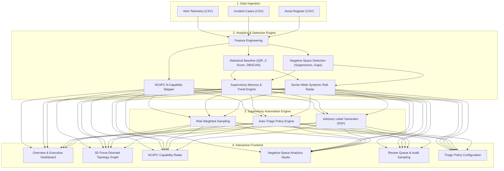

# SAT-SA — Supervisory Analytics Tool for SOC Assessment

> **Evidence-driven, negative-space cybersecurity supervision, compliance auditing, and multi-entity assessment platform for Critical Sector Entities (CSEs).**

[](https://www.python.org/)
[](https://fastapi.tiangolo.com/)
[](https://react.dev/)
[](https://vitejs.dev/)
[](https://tailwindcss.com/)
[](https://threejs.org/)
[](LICENSE)

---

## 🎯 Executive Overview

Traditional cybersecurity supervision of Critical Sector Entities (such as power grids, banking institutions, telecommunications, transport, and defence contractors) largely relies on **self-assessment questionnaires, subjective attestations, and periodic point-in-time audits**. These methods often fail to reflect actual operational effectiveness, leaving blind spots and undetected operational drift.

**SAT-SA (Supervisory Analytics Tool for SOC Assessment)** revolutionizes cybersecurity oversight by pivoting supervision from **declarative claims** to **empirical operational telemetry**. By analyzing raw security operation logs—including alert streams, incident ticketing cases, asset inventories, and triage metrics—SAT-SA computes quantitative risk scores, identifies peer deviations, uncovers negative-space anomalies, and automates supervisory workflows.

---

## 🚀 Core Features & Innovations

### 1. 🔍 Negative-Space Detection Engine
Unlike conventional SIEMs and monitoring systems that only trigger on known attack signatures, SAT-SA detects **Negative Space**—identifying what *should* be present in an active, healthy Security Operations Center (SOC) but is suspiciously absent:
- **Dormancy & Quiet Periods**: Identifies unnatural zero-alert windows, off-hours silence, or weekend log drops indicating telemetry suppression or log pipeline failures.
- **Triage Suppression & Severity Inversion**: Uncovers entities suppressing Critical/High-severity alerts or closing incidents abnormally fast without forensic artifact attachment.
- **Dark Asset Coverage**: Cross-references active IP/hostname telemetry against authoritative asset registers to flag unmonitored critical infrastructure.

### 2. 🌐 Sector-Wide Systemic Risk Radar
- **Cross-Entity Clustering**: Aggregates operational telemetry across all sector participants to identify correlated systemic failures.
- **Contagion & Supply-Chain Risk**: Pinpoints shared technology stack vulnerabilities, widespread vendor misconfigurations, and systemic compliance lapses affecting multiple entities simultaneously.

### 3. 🛡️ NCIIPC 8-Capability Compliance Framework
Maps operational evidence directly to the **NCIIPC (National Critical Information Infrastructure Protection Centre)** Cybersecurity Capability Framework:
1. **Threat Intelligence (TI)**
2. **Continuous Monitoring & Detection (CMD)**
3. **Incident Handling & Response (IHR)**
4. **Vulnerability Management (VM)**
5. **Cyber Crisis Management (CCM)**
6. **Forensic & Investigation (FI)**
7. **Threat Hunting (TH)**
8. **Compliance & Governance (CG)**
- Visualized through an interactive 8-axis **Compliance Radar Chart** providing instant capability gap analysis per entity.

### 4. 📈 Supervisory Memory & Longitudinal Trend Engine
- **Cycle-over-Cycle Progression**: Retains historical assessment records across supervisory inspection cycles.
- **3-Way Finding Categorization**: Automatically groups findings into:
  - 🟢 **Resolved**: Deficiencies remediated since previous cycle.
  - 🟡 **New**: Freshly identified gaps in the current cycle.
  - 🔴 **Recurring / Chronic**: Multi-cycle unresolved defects flagged with **Chronic Non-Compliance Badges**.

### 5. 📑 Automated Supervisory Advisory Letters
- **Regulatory Drafting Engine**: Automatically generates formal supervisory letters and compliance advisories citing observed operational evidence, statutory references, and required corrective action plans.
- **In-App Editing & PDF Export**: Supervisors can inspect, edit, and export publication-ready official regulatory notices via ReportLab PDF generation.

### 6. 🎲 Risk-Weighted Sampling & Review Queue
- **Statistically Grounded Auditing**: Replaces random inspection with risk-weighted stratified sampling of alerts, cases, and assets.
- **Auditor Workflow**: Interactive queue for off-site and on-site audit verification with instant CSV export.

### 7. ⚖️ Policy-Driven Auto-Triage Engine
- **Configurable Regulatory Rules**: Automates triage classification based on risk score thresholds, chronic non-compliance history, and critical asset exposures.
- **Automated Actions**: Triggers *Immediate Escalation*, *Priority Review*, or *Routine Verification* workflows.

### 8. 🪐 3D Interactive Assessment Topology
- Real-time **WebGL Force-Directed 3D Graph** powered by Three.js and `react-force-graph-3d`.
- Visualizes entities, risk tiers, capability clusters, and systemic relationships in a 3D orbital space with camera controls and interactive node inspection.

---

## 🏗️ System Architecture



---

## 📂 Project Structure

```
sat-sa-main/
├── backend/
│   ├── analytics/
│   │   ├── advisory_template.py     # Regulatory advisory letter & PDF generator
│   │   ├── capability_mapping.py    # NCIIPC 8-capability taxonomy & mapping
│   │   ├── capability_score.py      # Capability scoring & radar metrics
│   │   ├── feature_engineering.py   # SOC telemetry feature extraction
│   │   ├── negative_space.py        # Suppression & gap detection engine
│   │   ├── risk_score.py            # Composite multi-factor risk engine
│   │   ├── rules.py                 # Compliance & heuristic audit rules
│   │   ├── sampling.py              # Risk-weighted stratified sampling
│   │   ├── statistical.py           # Anomaly & outlier detection (IQR, Z-score)
│   │   ├── systemic_patterns.py     # Sector-wide systemic risk clustering
│   │   ├── trend_analysis.py        # Cycle-over-cycle supervisory memory
│   │   └── triage_engine.py         # Policy-driven auto-triage engine
│   ├── models/
│   │   └── orm.py                   # SQLAlchemy database schemas
│   ├── routers/
│   │   ├── analyse.py               # Data analysis & execution endpoints
│   │   └── entities.py              # Entity & telemetry CRUD endpoints
│   ├── db.py                        # Database session & engine configuration
│   ├── main.py                      # FastAPI application entrypoint
│   └── requirements.txt             # Python backend dependencies
├── data/
│   ├── generate_sample_data.py      # Synthetic evidence generation engine
│   └── sample/                      # Sample datasets (CSE-01, CSE-07, CSE-11, etc.)
├── frontend/
│   ├── src/
│   │   ├── components/
│   │   │   ├── AssessmentTopology3D.jsx # WebGL 3D force-directed topology
│   │   │   ├── ErrorBanner.jsx          # Alert banner component
│   │   │   ├── LoadingSpinner.jsx       # Async loading state
│   │   │   ├── MetricCard.jsx           # KPI & metric summary cards
│   │   │   ├── Navbar.jsx               # Navigation bar
│   │   │   ├── RiskBadge.jsx            # Dynamic severity & risk badges
│   │   │   └── ScoreBar.jsx             # Color-coded progress indicators
│   │   ├── pages/
│   │   │   ├── AnalyticsPage.jsx        # Deep-dive statistical analytics
│   │   │   ├── DataQualityPage.jsx      # Telemetry hygiene & data validation
│   │   │   ├── DrilldownPage.jsx        # Entity profile, NCIIPC radar & advisory
│   │   │   ├── EntitiesPage.jsx         # Monitored entities inventory
│   │   │   ├── EvidencePage.jsx         # Raw evidence & log viewer
│   │   │   ├── ExecutionGapsPage.jsx    # SLA & operational deficiency analysis
│   │   │   ├── FindingsPage.jsx         # Supervisory findings & non-compliances
│   │   │   ├── NegativeSpacePage.jsx    # Missing alerts & suppression dashboard
│   │   │   ├── OverviewPage.jsx         # Executive command center
│   │   │   ├── RankingPage.jsx          # Peer comparison & risk rank table
│   │   │   ├── ReportsPage.jsx          # Formal audit & supervisory reports
│   │   │   ├── ReviewQueuePage.jsx      # Risk-weighted sampling & audit queue
│   │   │   ├── TriagePoliciesPage.jsx   # Auto-triage policy engine
│   │   │   └── UploadPage.jsx           # Evidence ingestion portal
│   │   ├── api.js                       # Axios API client bindings
│   │   ├── App.jsx                      # Client router & page routes
│   │   └── index.css                    # Tailwind CSS definitions
│   ├── package.json                     # Frontend dependencies & scripts
│   └── vite.config.js                   # Vite configuration
├── test_automation_features.py          # Test suite for automation & compliance
├── test_pipeline.py                     # Full end-to-end integration test suite
├── setup.bat                            # Automated 1-click installation script
├── start.bat                            # Quick launch script
└── README.md                            # Comprehensive project documentation
```

---

## ⚡ Quick Start Guide

### Prerequisites
- **Python**: Version `3.10` or higher
- **Node.js**: Version `18.x` or higher (with `npm`)

---

### Option A: One-Click Setup (Windows)

1. **Run Setup**:
   ```cmd
   setup.bat
   ```
   *This automatically creates the Python venv, installs backend & frontend dependencies, builds the React app, initializes the database, and generates synthetic sample datasets.*

2. **Launch Application**:
   ```cmd
   start.bat
   ```

3. Open your browser and navigate to:
   ```
   http://localhost:8000
   ```

---

### Option B: Manual Installation

#### 1. Backend Setup
```bash
# Create and activate virtual environment
python -m venv venv

# Windows:
call venv\Scripts\activate
# Linux/macOS:
# source venv/bin/activate

# Install Python packages
pip install -r backend/requirements.txt

# Initialise database schemas
python -c "import sys; sys.path.insert(0,'backend'); from db import engine; from models.orm import Base; Base.metadata.create_all(bind=engine); print('Database Initialized Successfully')"

# (Optional) Generate synthetic sample data
python data/generate_sample_data.py
```

#### 2. Frontend Setup
```bash
cd frontend

# Install Node dependencies
npm install

# Build production bundle (served by FastAPI)
npm run build

# (Or run frontend in Vite hot-reload development mode)
# npm run dev
```

#### 3. Start Backend Server
```bash
# From the root directory:
python -m uvicorn backend.main:app --host 0.0.0.0 --port 8000 --reload
```

- **Application URL**: [http://localhost:8000](http://localhost:8000)
- **Interactive OpenAPI Documentation**: [http://localhost:8000/docs](http://localhost:8000/docs)

---

## 🧪 Testing & Verification

Run the comprehensive automated test suites to verify all analytics, detection algorithms, and API endpoints:

```bash
# Activate virtual environment
call venv\Scripts\activate

# Run end-to-end integration tests (ingestion, negative space, risk scoring)
python test_pipeline.py

# Run supervisory automation feature test suite (NCIIPC, trends, advisory, sampling, triage)
python test_automation_features.py
```

Both test suites should exit with `100% pass` status.

---

## 📊 Key API Endpoints

| Method | Endpoint | Description |
|---|---|---|
| `GET` | `/api/entities/` | List all assessed critical sector entities |
| `GET` | `/api/entities/{id}` | Detailed entity profile and risk metrics |
| `POST` | `/api/entities/` | Register a new monitored entity |
| `POST` | `/api/analyse/{id}` | Execute full supervisory analytics pipeline on entity evidence |
| `GET` | `/api/negative-space/{id}` | Retrieve negative-space anomalies and suppression detections |
| `GET` | `/api/systemic-patterns/` | Fetch sector-wide systemic risk clusters and contagion radar |
| `GET` | `/api/entities/{id}/capabilities` | Compute NCIIPC 8-capability scores and radar metrics |
| `GET` | `/api/entities/{id}/trend` | Cycle-over-cycle comparative trend analysis (New/Resolved/Recurring) |
| `POST` | `/api/entities/{id}/advisory/generate` | Auto-generate formal supervisory advisory draft |
| `GET` | `/api/entities/{id}/advisory/pdf` | Export publication-ready official advisory letter in PDF format |
| `POST` | `/api/sampling/generate` | Generate risk-weighted sample review queue for auditors |
| `GET` | `/api/sampling/export` | Export sampling review records to CSV |
| `GET` | `/api/triage/policies` | Retrieve active automated triage policies |
| `POST` | `/api/triage/evaluate` | Evaluate all entities against regulatory triage rules |

---

## 🔒 Security & Data Privacy

- **Data Minimization**: SAT-SA evaluates operational metadata (timestamps, incident categories, asset criticalities, SLA timings) without requiring sensitive packet payloads or proprietary source code.
- **Air-Gapped Deployment**: Self-contained architecture with SQLite/DuckDB requiring no external cloud telemetry or third-party SaaS dependencies.
- **Deterministic Evidence Hashing**: Every finding is backed by deterministic, reproducible statistical and heuristic calculations with exact audit trails.

---

## 📜 License & SIH Note

This project is built for the **Smart India Hackathon (SIH)** under the Cybersecurity domain.

Released under the **MIT License**. Feel free to use, modify, and distribute for supervisory research, compliance auditing, and cybersecurity capability development.